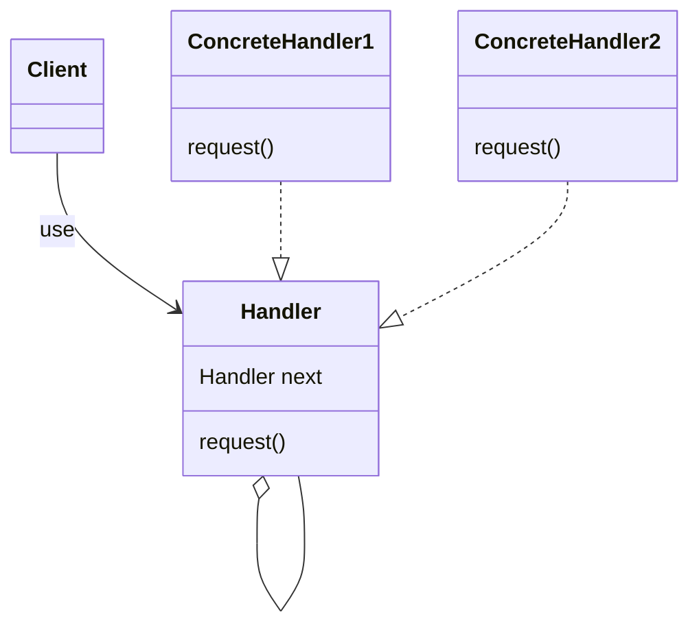
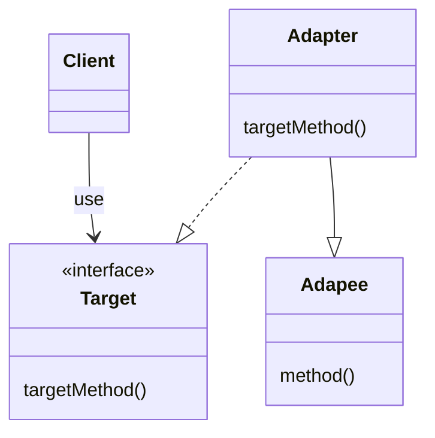
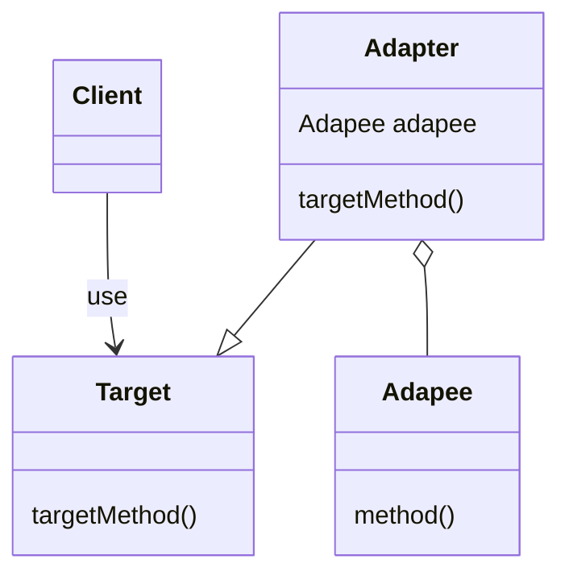
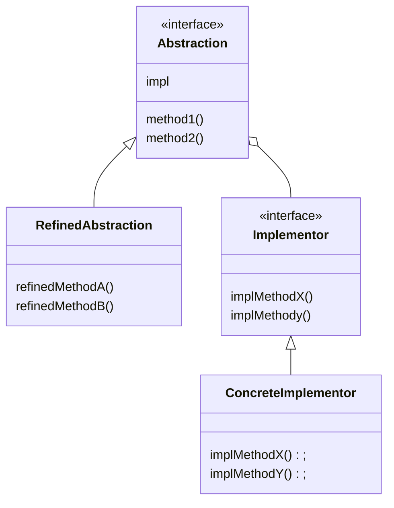
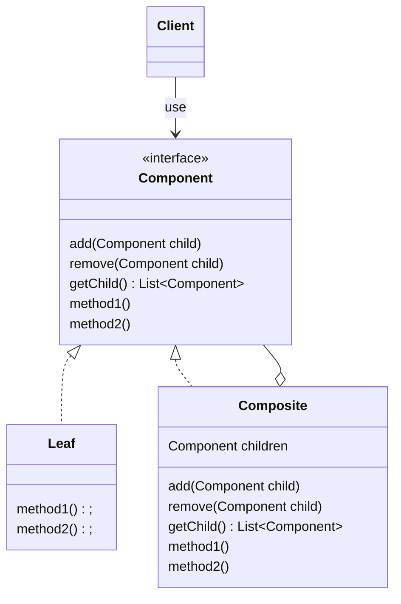
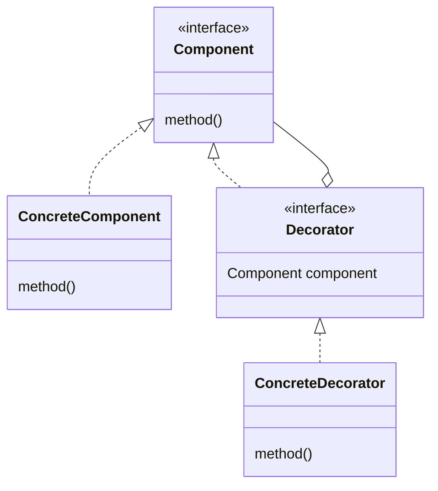
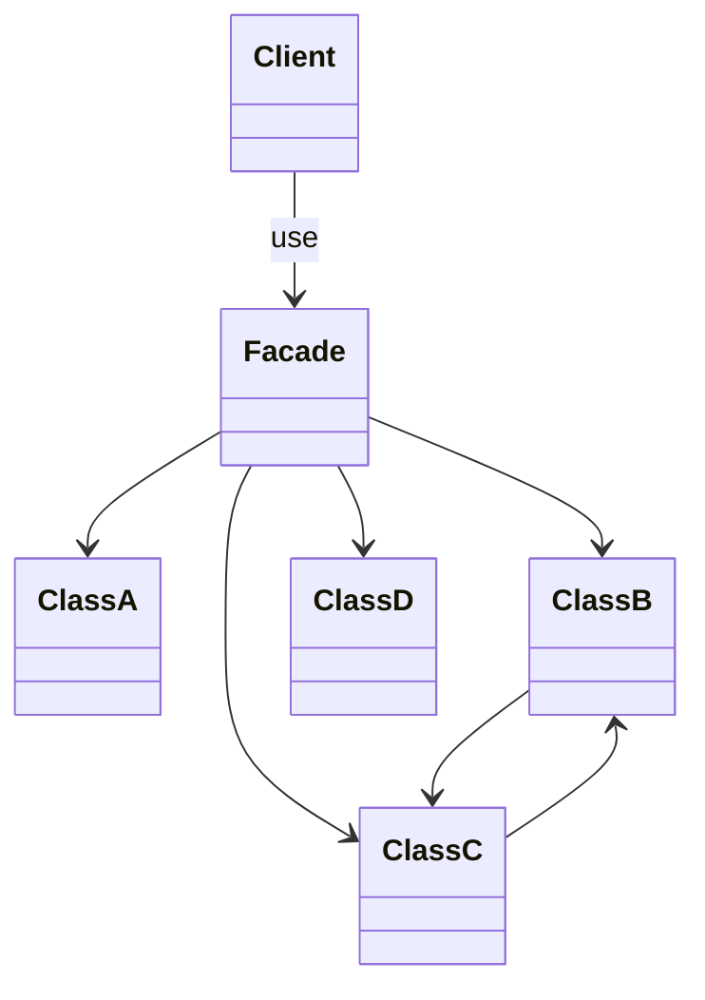
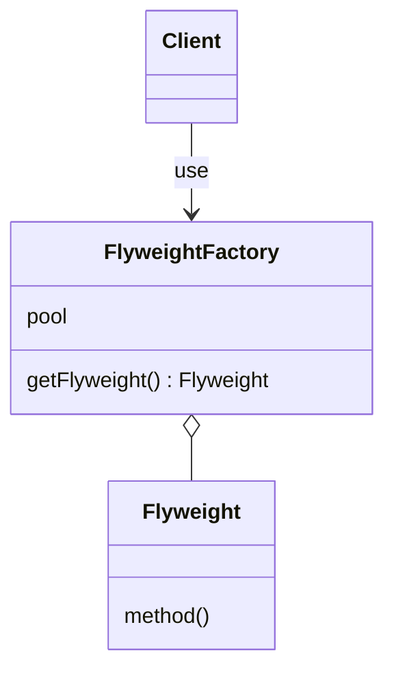
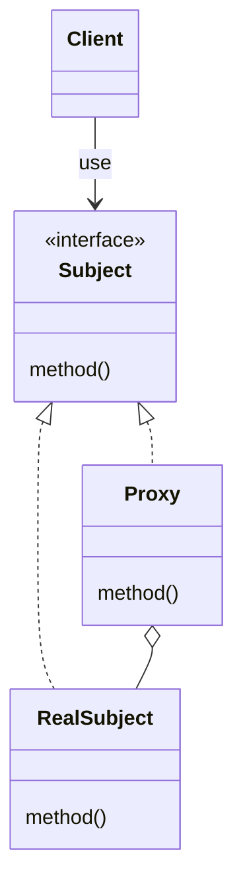

# 设计模式 Design Pattern

参考

- 在线电子书 Refactoring[https://refactoringguru.cn/](https://refactoringguru.cn/)
- 《图解设计模式》

## UML 一览

### 创建型模式 creational

#### Chain Of Responsibility Pattern

#### Command Pattern

#### Iterator Pattern

#### Mediator Pattern

#### Memento Pattern

#### Observer Pattern

#### State Pattern

#### Strategy Pattern

#### Template Method Pattern

#### Visitor Pattern

#### Interpreter Pattern

### 行为型模式 behavioral

#### Adapter Pattern

- 类适配器模式

- 对象适配器模式

#### Bridge Pattern

#### Composite Pattern

#### Decorator Pattern

#### Facade Pattern

#### Flyweight Pattern

#### Proxy Pattern

### 创建型模式 structural

#### Factory Method Pattern

#### Abstract Factory Pattern

#### Builder Pattern

#### Prototype Pattern

#### Singleton Pattern
