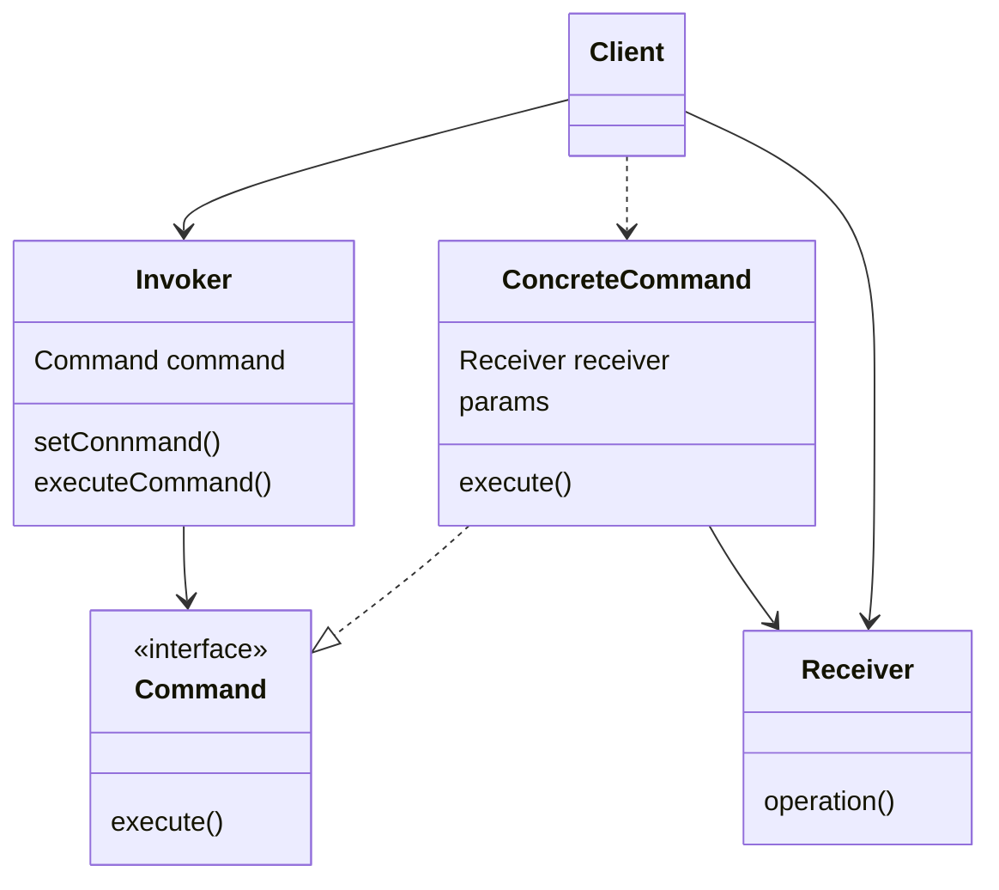

# Command 模式

将请求转换为一个包含**与请求相关的所有信息**的独立对象。

该转换让你能根据不同的请求将**方法参数化**、**延迟请求执行**或将其**放入队列中**，且能实现可撤销操作。

## 类图



- Invoker：负责对请求进行初始化，必须包含一个成员变量来存储对于命令对象的引用。Invoker 会触发命令执行，而不向 Receiver 直接发送请求。Invoker 并不负责创建命令对象，它通常通过构造函数从 Client 处获得预先生成的命令。
- Command：定义命令的接口。
- ConcreteCommand：实现 Command 定义的接口。自身并不完成工作，而是会将调用委派给一个业务逻辑对象。接收对象执行方法所需的参数可以声明为具体命令的成员变量。 你可以将命令对象设为不可变， 仅允许通过构造函数对这些成员变量进行初始化。
- Receiver：包含部分业务逻辑，接收命令的对象，自己会完成实际工作。
- Client：生成 ConcreteCommand 并分配 Reciever。客户端必须将包括 Receiver 在内的所有请求参数传递给 Command 的构造函数。

## 相关设计模式

- Composite 模式：有时胡i使用 Composite 模式实现宏命令。
- Memento 模式：有时会使用 Memento 模式来保存 Command 角色的历史记录。
- Protoype 模式：有时会使用 Prototype 模式复制发生的事件。

## 代码

```java
public interface Command {
    public abstract void execute();
}

public class MacroCommand implements Command {
    // 命令的集合
    private Stack commands = new Stack();
    // 执行
    public void execute() {
        Iterator it = commands.iterator();
        while (it.hasNext()) {
            ((Command)it.next()).execute();
        }
    }
    // 添加命令
    public void append(Command cmd) {
        if (cmd != this) {
            commands.push(cmd);
        }
    }
    // 删除最后一条命令
    public void undo() {
        if (!commands.empty()) {
            commands.pop();
        }
    }
    // 删除所有命令
    public void clear() {
        commands.clear();
    }
}

public class DrawCommand implements Command {
    // 绘制对象
    protected Drawable drawable;
    // 绘制位置
    private Point position;
    // 构造函数
    public DrawCommand(Drawable drawable, Point position) {
        this.drawable = drawable;
        this.position = position;
    }
    // 执行
    public void execute() {
        drawable.draw(position.x, position.y);
    }
}

public interface Drawable {
    public abstract void draw(int x, int y);
}

public class DrawCanvas extends Canvas implements Drawable {
    // 颜色
    private Color color = Color.red;
    // 要绘制的圆点的半径
    private int radius = 6;
    // 命令的历史记录
    private MacroCommand history;
    // 构造函数
    public DrawCanvas(int width, int height, MacroCommand history) {
        setSize(width, height);
        setBackground(Color.white);
        this.history = history;
    }
    // 重新全部绘制
    public void paint(Graphics g) {
        history.execute();
    }
    // 绘制
    public void draw(int x, int y) {
        Graphics g = getGraphics();
        g.setColor(color);
        g.fillOval(x - radius, y - radius, radius * 2, radius * 2);
    }
}
```

```java
public class Main extends JFrame implements ActionListener, MouseMotionListener, WindowListener {
    // 绘制的历史记录
    private MacroCommand history = new MacroCommand();
    // 绘制区域
    private DrawCanvas canvas = new DrawCanvas(400, 400, history);
    // 删除按钮
    private JButton clearButton  = new JButton("clear");

    // 构造函数
    public Main(String title) {
        super(title);

        this.addWindowListener(this);
        canvas.addMouseMotionListener(this);
        clearButton.addActionListener(this);

        Box buttonBox = new Box(BoxLayout.X_AXIS);
        buttonBox.add(clearButton);
        Box mainBox = new Box(BoxLayout.Y_AXIS);
        mainBox.add(buttonBox);
        mainBox.add(canvas);
        getContentPane().add(mainBox);

        pack();
        show();
    }

    // ActionListener接口中的方法
    public void actionPerformed(ActionEvent e) {
        if (e.getSource() == clearButton) {
            history.clear();
            canvas.repaint();
        }
    }

    // MouseMotionListener接口中的方法
    public void mouseMoved(MouseEvent e) {
    }
    public void mouseDragged(MouseEvent e) {
        Command cmd = new DrawCommand(canvas, e.getPoint());
        history.append(cmd);
        cmd.execute();
    }

    // WindowListener接口中的方法
    public void windowClosing(WindowEvent e) {
        System.exit(0);
    }
    public void windowActivated(WindowEvent e) {}
    public void windowClosed(WindowEvent e) {}
    public void windowDeactivated(WindowEvent e) {}
    public void windowDeiconified(WindowEvent e) {}
    public void windowIconified(WindowEvent e) {}
    public void windowOpened(WindowEvent e) {}

    public static void main(String[] args) {
        new Main("Command Pattern Sample");
    }
}
```
