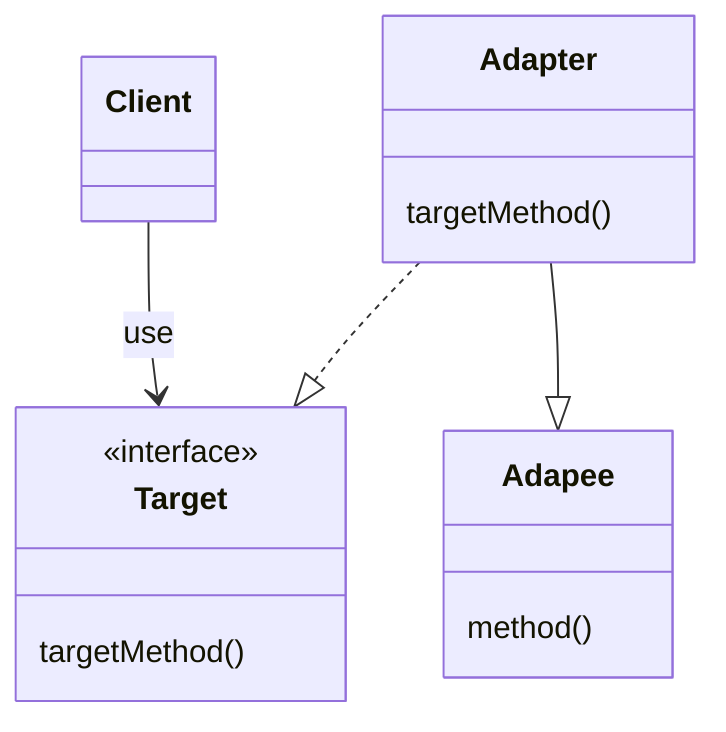
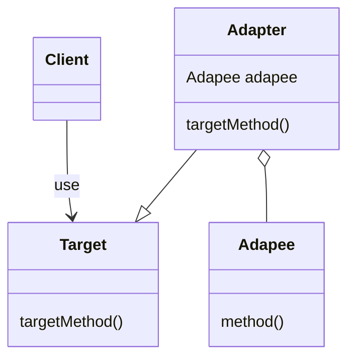

# Adapter 模式

可以有两种实现方式：

1. 类适配器模式（使用继承的适配器）
1. 对象适配器模式（使用委托的适配器）

## 类图

类适配器模式



对象适配器模式



- Target：负责定义所需方法，通常由接口或者抽象类担任。
- Client：负责使用 Target 角色定义的方法进行具体处理。
- Adaptee：被适配者，持有既定方法的角色，需要通过适配器进行适配供 Client 使用。
- Adapter：使用 Adaptee 角色的方法来满足 Target 的需求。通过继承或聚合来使用 Adaptee 角色

## 要点

- 对现有的类进行适配，生成新的类。
- 让现有的类，适配新的 API 时，Adapter 模式可以在不改变现有代码的情况下，适配新的 API。
- 版本升级与兼容，新旧版本分别扮演 Adaptee 和 Target 角色，编写一个 Adapter 类进行新旧版本的适配。
- Adaptee 和 Target 角色的功能不同时，该模式是无法使用的。

## 相关设计模式

- Bridge 模式：Bridge 模式用于连接类的功能层次结构与实现层次结构。Adapter 模式用于连接 API 不同的类
- Decorator 模式：Decorator 模式是在不改变 API 的前提下，增加功能。Adapter 用于填补不同 API 之间的缝隙。

## 代码

### 类适配器模式

```java
//扮演实际情况
public class Banner {
    private String string;
    public Banner(String string) {
        this.string = string;
    }
    public void showWithParen() {
        System.out.println("(" + string + ")");
    }
    public void showWithAster() {
        System.out.println("*" + string + "*");
    }
}

//扮演需求接口
public interface Print{
    public abstract void printWeak();
    public abstract void printStrong();
}

//扮演适配器
public class PrintBanner extends Banner implement Print {
    public PrintBanner(String string) {
        super(string);
    }
    public void printWeak() {
        showWithParen();
    }
    public void printStrong() {
        showWithAster();
    }
}

public class Main {
    public static void main(String[] args) {
        Print p = new PringBanner("Hello");
        p.printWeak();
        p.pringString();
    }
}
```

### 对象适配器模式

```java
//扮演实际情况
public class Banner {
    private String string;
    public Banner(String string) {
        this.string = string;
    }
    public void showWithParen() {
        System.out.println("(" + string + ")");
    }
    public void showWithAster() {
        System.out.println("*" + string + "*");
    }
}

//Print 不是接口而是类
public abstract class Print {
    public abstract void printWeak();
    public abstract void printStrong();
}

public class PrintBanner extends Print {
    private Banner banner;
    public PrintBanner(String string) {
        this.banner = new Banner(string);
    }
    public void printWeak() {
        banner.showWithParen();
    }
    public void printStrong() {
        banner.showWithAster();
    }
}
```
