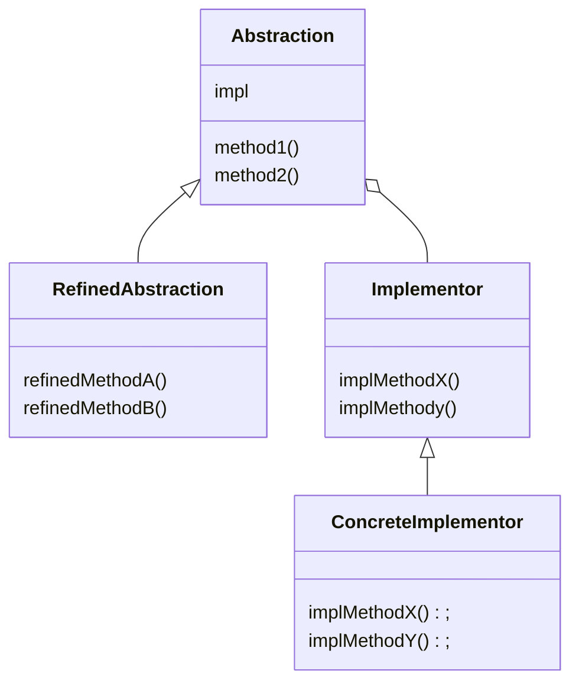

# Bridge 模式

连接**类的功能层次结构**和**类的实现层次结构**。

增加新功能时，会继承已有的类，扩展其功能。这样之后，父类拥有基本功能，子类拥有扩展功能，这种结构被称为**类的功能层次结构**。

父类通过声明抽象方法定义接口，子类通过实现具体方法来实现接口，这种层次结构被称为**类的实现层次结构**。

Bridge 模式就是将两个层次分离为独立的类层次结构，并搭建桥梁。

## 类图



- Abstraction：该角色位于类的功能层次结构的最上层，它使用 Implementor 角色的方法定义了基本的功能。该角色中保存了 Implementor 角色的实例。
- RefinedAbstraction：是增加了新功能的角色。
- Implementor：该角色位于类的实现层次结构的最上层，它定义了用于实现 Abstraction 角色的接口的方法。
- ConcreteImplementor：实现 Implementor 角色中定义的接口。
- Abstraction 相关的两个类，构成了类的功能层次结构；Implementor 相关的两个类构成了类的实现层次结构。两个层次结构之间的桥梁是 impl 字段。

## 要点

- 分开后更容易扩展：将这两个层次结构分离开，有利于独立的对他们进行扩展。
- 继承是强关联，组合/聚合是弱关联。

## 相关设计模式

- Adapter 模式：Bridge 模式可以达到类的功能层次结构和类的实现层次结构分离的目的， 并在次基础上使这些层次结构结合起来；而 Adapter 模式则可以结合那些功能上相似但是接口不同的类。
- Template Method 模式：该模式使用了**类的实现层次结构**，父类调用抽象方法，而子类实现抽象方法。
- Abstract Factory 模式：为了能够根据需求设计出良好的 ConcreteImplementor 角色，有时我们会使用 AbstractFactory 模式。

## 代码

- 类的功能层次结构

```java
public class Display {
    private DisplayImpl impl;
    public Display(DisplayImpl impl) {
        this.impl = impl;
    }
    public void open() {
        impl.rawOpen();
    }
    public void print() {
        impl.rawPrint();
    }
    public void close() {
        impl.rawClose();
    }
    public final void display() {
        open();
        print();
        close();
    }
}

public class CountDisplay extends Display {
    public CountDisplay(DisplayImpl impl) {
        super(impl);
    }
    public void multiDisplay(int times) {       // 循环显示times次
        open();
        for (int i = 0; i < times; i++) {
            print();
        }
        close();
    }
}
```

- 类的实现层次结构

```java
public abstract class DisplayImpl {
    public abstract void rawOpen();
    public abstract void rawPrint();
    public abstract void rawClose();
}

public class StringDisplayImpl extends DisplayImpl {
    private String string;                              // 要显示的字符串
    private int width;                                  // 以字节单位计算出的字符串的宽度
    public StringDisplayImpl(String string) {           // 构造函数接收要显示的字符串string
        this.string = string;                           // 将它保存在字段中
        this.width = string.getBytes().length;          // 把字符串的宽度也保存在字段中，以供使用。
    }
    public void rawOpen() {
        printLine();
    }
    public void rawPrint() {
        System.out.println("|" + string + "|");         // 前后加上"|"并显示
    }
    public void rawClose() {
        printLine();
    }
    private void printLine() {
        System.out.print("+");                          // 显示用来表示方框的角的"+"
        for (int i = 0; i < width; i++) {               // 显示width个"-"
            System.out.print("-");                      // 将其用作方框的边框
        }
        System.out.println("+");                        // 显示用来表示方框的角的"+"
    }
}
```

使用

```java
public class Main {
    public static void main(String[] args) {
        Display d1 = new Display(new StringDisplayImpl("Hello, China."));
        Display d2 = new CountDisplay(new StringDisplayImpl("Hello, World."));
        CountDisplay d3 = new CountDisplay(new StringDisplayImpl("Hello, Universe."));
        d1.display();
        d2.display();
        d3.display();
        d3.multiDisplay(5);
    }
}
```
