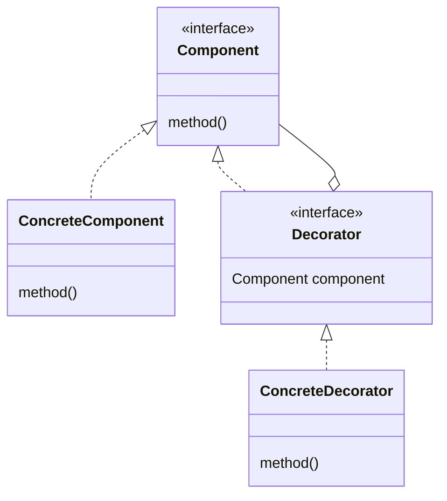

# Decorator 模式

装饰边框与装饰物的一致性。

不断地为对象添加装饰。

## 类图



- Component：增加功能时的核心角色，定义功能接口。
- ConcreteComponent：该角色实现了 Component 所定义的接口。
- Decorator：该角色实现了 Component 定义的接口，在它内部保存了被装饰的对象 Component 角色。
- ConcreteCDecorator：具体的 Decorator 角色，实现了 Decorator 定义的接口。

## 要点

- 接口的透明性：装饰边框与被装饰物具有一致性。
- 与 Composite 模式不同，本模式主要是通过添加装饰物来增加对象的功能，虽然他们都有递归结构。
- 在不改变被装饰物的前提下增加功能。
- 可以动态的增加功能。
- 只需要一些装饰物即可添加许多功能。
- 导致增加许多很小的类，功能类似。

## 相关设计模式

- Adapter 模式：Adapter 模式用于适配两个不同的接口；Decorator 模式可以在不改变被装饰物的接口的前提下，为被装饰物添加边框。
- Strategy 模式：Strategy 模式是通过整体地替换算法来改变类的功能；Decorator 模式通过改变被装饰物的边框或者为被装饰物添加多重边框，来增加类的功能。

## 代码

### Java

```java
public abstract class Display {
    public abstract int getColumns();               // 获取横向字符数
    public abstract int getRows();                  // 获取纵向行数
    public abstract String getRowText(int row);     // 获取第row行的字符串
    public void show() {                            // 全部显示
        for (int i = 0; i < getRows(); i++) {
            System.out.println(getRowText(i));
        }
    }
}

public class StringDisplay extends Display {
    private String string;                          // 要显示的字符串
    public StringDisplay(String string) {           // 通过参数传入要显示的字符串
        this.string = string;
    }
    public int getColumns() {                       // 字符数
        return string.getBytes().length;
    }
    public int getRows() {                          // 行数是1
        return 1;
    }
    public String getRowText(int row) {             // 仅当row为0时返回值
        if (row == 0) {
            return string;
        } else {
            return null;
        }
    }
}

public abstract class Border extends Display {
    protected Display display;          // 表示被装饰物
    protected Border(Display display) { // 在生成实例时通过参数指定被装饰物
        this.display = display;
    }
}

public class SideBorder extends Border {
    private char borderChar;                        // 表示装饰边框的字符
    public SideBorder(Display display, char ch) {   // 通过构造函数指定Display和装饰边框字符
        super(display);
        this.borderChar = ch;
    }
    public int getColumns() {                       // 字符数为字符串字符数加上两侧边框字符数
        return 1 + display.getColumns() + 1;
    }
    public int getRows() {                          // 行数即被装饰物的行数
        return display.getRows();
    }
    public String getRowText(int row) {             // 指定的那一行的字符串为被装饰物的字符串加上两侧的边框的字符
        return borderChar + display.getRowText(row) + borderChar;
    }
}

public class FullBorder extends Border {
    public FullBorder(Display display) {
        super(display);
    }
    public int getColumns() {                   // 字符数为被装饰物的字符数加上两侧边框字符数
        return 1 + display.getColumns() + 1;
    }
    public int getRows() {                      // 行数为被装饰物的行数加上上下边框的行数
        return 1 + display.getRows() + 1;
    }
    public String getRowText(int row) {         // 指定的那一行的字符串
        if (row == 0) {                                                 // 上边框
            return "+" + makeLine('-', display.getColumns()) + "+";
        } else if (row == display.getRows() + 1) {                      // 下边框
            return "+" + makeLine('-', display.getColumns()) + "+";
        } else {                                                        // 其他边框
            return "|" + display.getRowText(row - 1) + "|";
        }
    }
    private String makeLine(char ch, int count) {         // 生成一个重复count次字符ch的字符串
        StringBuffer buf = new StringBuffer();
        for (int i = 0; i < count; i++) {
            buf.append(ch);
        }
        return buf.toString();
    }
}
```

### Kotlin

```kotlin
fun Panda.bamboo(decorator: () -> Unit) {
    eat()
    println("可以吃竹子")
    decorator()
}

fun Panda.carrot(decorator: () -> Unit) {
    println("可以吃胡罗卜")
    decorator()
}

fun main() {
    Panda().run {
        bamboo {
            carrot {
                
            }
        }
    }
}
```
